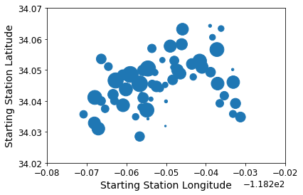
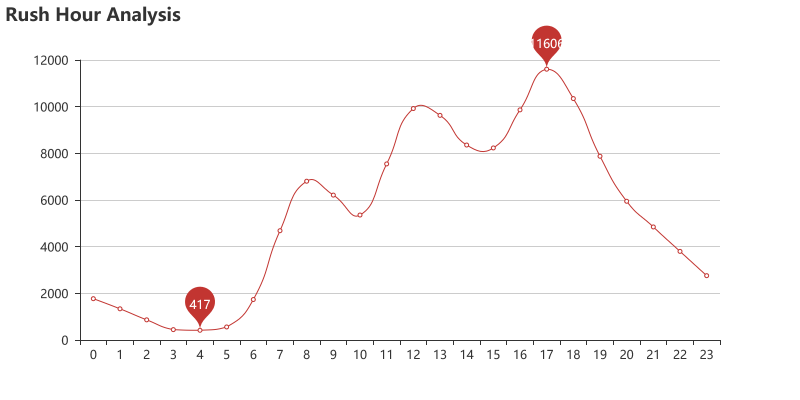
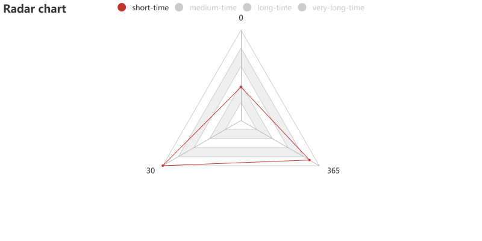
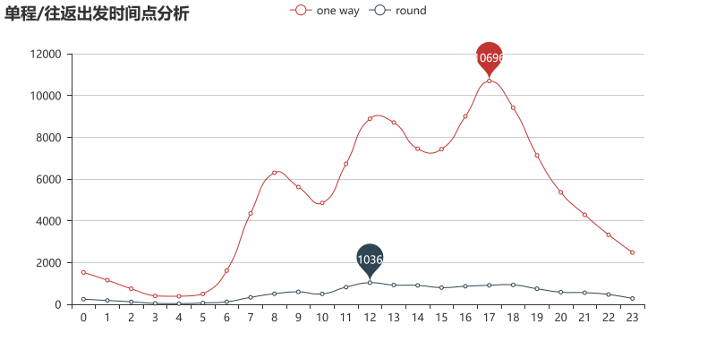
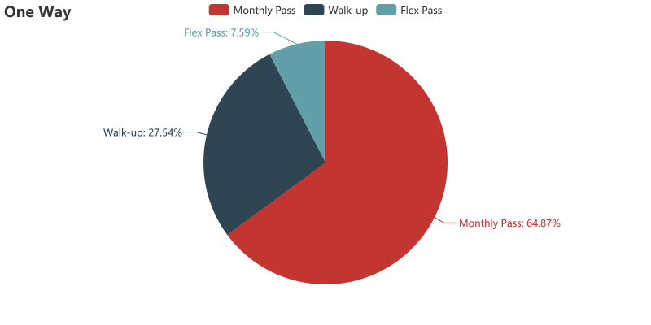
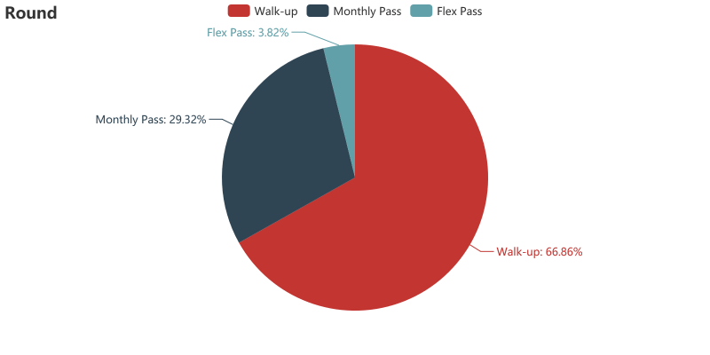

# 读取数据集😄


```
import pandas as pd
import warnings

warnings.filterwarnings('ignore')
```


```
data = pd.read_csv('./dataset/metro-bike-share-trip-data.csv')
```


```
data.head(1)
```


<div>
<style scoped>
    .dataframe tbody tr th:only-of-type {
        vertical-align: middle;
    }


</style>
<table border="1" class="dataframe">
  <thead>
    <tr style="text-align: right;">
      <th></th>
      <th>Trip ID</th>
      <th>Duration</th>
      <th>Start Time</th>
      <th>End Time</th>
      <th>Starting Station ID</th>
      <th>Starting Station Latitude</th>
      <th>Starting Station Longitude</th>
      <th>Ending Station ID</th>
      <th>Ending Station Latitude</th>
      <th>Ending Station Longitude</th>
      <th>Bike ID</th>
      <th>Plan Duration</th>
      <th>Trip Route Category</th>
      <th>Passholder Type</th>
      <th>Starting Lat-Long</th>
      <th>Ending Lat-Long</th>
    </tr>
  </thead>
  <tbody>
    <tr>
      <th>0</th>
      <td>1912818</td>
      <td>180</td>
      <td>2016-07-07T04:17:00</td>
      <td>2016-07-07T04:20:00</td>
      <td>3014.0</td>
      <td>34.05661</td>
      <td>-118.23721</td>
      <td>3014.0</td>
      <td>34.05661</td>
      <td>-118.23721</td>
      <td>6281.0</td>
      <td>30.0</td>
      <td>Round Trip</td>
      <td>Monthly Pass</td>
      <td>{'longitude': '-118.23721', 'latitude': '34.05...</td>
      <td>{'longitude': '-118.23721', 'latitude': '34.05...</td>
    </tr>
  </tbody>
</table>
</div>


# 分析思路(Analysis methods)😜

- 热门Station分布分析(**Distribution of Hot Stations**)
- 2.共享单车出行高峰时间段分析(**Rush Hour Analysis**)
- 3.单程与往返的比较分析(**Round Trip/One Way Comparison Analysis**)
- 使用时长与会员卡类型的关联度分析(**relevancy analysis between Duration&Passholder Type**)

---

# 开始数据分析(Data Analysis)😁

### 1）共享单车热门开始站分布可视化探索


```
pic = st_info.plot(kind="scatter", x="Starting Station Longitude", y="Starting Station Latitude",s = st_info['Counts']/10,
                        alpha=1)
plt.axis([-118.28,-118.22,34.02,34.07])
plt.show()
```





### Conclusion

- If there is a **L.A. map** should be better to analysis...

---

## 2）共享单车出行高峰时间段分析(Rush Hour Analysis)





### Conclusion

- 共享单车出行者通常选择在**7a.m.-20p.m.**出行
- **6a.m.-8a.m.**早高峰时段，**10a.m.-12a.m.**午高峰时段以及**15a.m.-17a.m.晚高峰时段**都有明显的用车量增加。
- 出行最高峰是**17p.m**.，推测为**下班晚高峰**
- 出行最低谷为**4a.m.**，凌晨的用车辆非常少
- 从高峰到低谷是一个完全**下降趋势**，用车辆逐渐降低

- Shared-bike riders usually choose to start their trip at **7a.m.-20p.m**
- **6a.m.-8a.m.**morning peak period, **10a.m.-12a.m.**afternoon peak period and **15a.m.-17a.m.**evening peak period shows significant increase in shared-bike use
- The peak of use is **17p.m.**, which is presumed to be **the evening peak**
- The lowest point of use is **4a.m**,few shared-bikes are used in mid-night
- From the peak to the lowest point is a **complete downward trend**, with the vehicle gradually reduced

---

## 3）单车使用时长与会员卡持有种类的相关性分析
## (relevancy analysis between Duration&Passholder Type)


```
bike_trip_info = bike_info[['Duration','Trip Route Category','Plan Duration','Passholder Type']]
bike_trip_info.head()
```


<div>
<style scoped>
    .dataframe tbody tr th:only-of-type {
        vertical-align: middle;
    }

    .dataframe tbody tr th {
        vertical-align: top;
    }

    .dataframe thead th {
        text-align: right;
    }
</style>
<table border="1" class="dataframe">
  <thead>
    <tr style="text-align: right;">
      <th></th>
      <th>Duration</th>
      <th>Trip Route Category</th>
      <th>Plan Duration</th>
      <th>Passholder Type</th>
    </tr>
  </thead>
  <tbody>
    <tr>
      <th>0</th>
      <td>180</td>
      <td>Round Trip</td>
      <td>30.0</td>
      <td>Monthly Pass</td>
    </tr>
    <tr>
      <th>1</th>
      <td>1980</td>
      <td>Round Trip</td>
      <td>30.0</td>
      <td>Monthly Pass</td>
    </tr>
    <tr>
      <th>2</th>
      <td>300</td>
      <td>Round Trip</td>
      <td>365.0</td>
      <td>Flex Pass</td>
    </tr>
    <tr>
      <th>3</th>
      <td>10860</td>
      <td>Round Trip</td>
      <td>365.0</td>
      <td>Flex Pass</td>
    </tr>
    <tr>
      <th>4</th>
      <td>420</td>
      <td>Round Trip</td>
      <td>0.0</td>
      <td>Walk-up</td>
    </tr>
  </tbody>
</table>
</div>


### 单独提取Duration，进行聚类(cluster by Duration)


```
duration = bike_trip_info[['Duration']]
duration.head()
# duration时间单位为 秒
```


<div>
<style scoped>
    .dataframe tbody tr th:only-of-type {
        vertical-align: middle;
    }

    .dataframe tbody tr th {
        vertical-align: top;
    }

    .dataframe thead th {
        text-align: right;
    }
</style>
<table border="1" class="dataframe">
  <thead>
    <tr style="text-align: right;">
      <th></th>
      <th>Duration</th>
    </tr>
  </thead>
  <tbody>
    <tr>
      <th>0</th>
      <td>180</td>
    </tr>
    <tr>
      <th>1</th>
      <td>1980</td>
    </tr>
    <tr>
      <th>2</th>
      <td>300</td>
    </tr>
    <tr>
      <th>3</th>
      <td>10860</td>
    </tr>
    <tr>
      <th>4</th>
      <td>420</td>
    </tr>
  </tbody>
</table>
</div>


```
bike_trip_info.head()
```


<div>
<style scoped>
    .dataframe tbody tr th:only-of-type {
        vertical-align: middle;
    }

    .dataframe tbody tr th {
        vertical-align: top;
    }

    .dataframe thead th {
        text-align: right;
    }
</style>
<table border="1" class="dataframe">
  <thead>
    <tr style="text-align: right;">
      <th></th>
      <th>Duration</th>
      <th>Duration Class</th>
      <th>Trip Route Category</th>
      <th>Plan Duration</th>
      <th>Passholder Type</th>
    </tr>
  </thead>
  <tbody>
    <tr>
      <th>0</th>
      <td>180</td>
      <td>short-time</td>
      <td>Round Trip</td>
      <td>30.0</td>
      <td>Monthly Pass</td>
    </tr>
    <tr>
      <th>1</th>
      <td>1980</td>
      <td>short-time</td>
      <td>Round Trip</td>
      <td>30.0</td>
      <td>Monthly Pass</td>
    </tr>
    <tr>
      <th>2</th>
      <td>300</td>
      <td>short-time</td>
      <td>Round Trip</td>
      <td>365.0</td>
      <td>Flex Pass</td>
    </tr>
    <tr>
      <th>3</th>
      <td>10860</td>
      <td>medium-time</td>
      <td>Round Trip</td>
      <td>365.0</td>
      <td>Flex Pass</td>
    </tr>
    <tr>
      <th>4</th>
      <td>420</td>
      <td>short-time</td>
      <td>Round Trip</td>
      <td>0.0</td>
      <td>Walk-up</td>
    </tr>
  </tbody>
</table>
</div>


**查看各类Duration数量**


```
bike_trip_info['Duration Class'].value_counts()
```


    short-time        127398
    medium-time         3180
    long-time            582
    very-long-time       501
    Name: Duration Class, dtype: int64


---

### Duration Class探索


### 雷达图可视化(Radar Chart)




### Conclusion

- 共享单车使用使用时间**特别长**的用户中**绝大部分使用者**是**即用即走型用户**
- **短途**共享单车使用者中**超过6成比例**为**月卡持有者**
- 其次，**短途**共享单车使用者中的**年卡持有者**的比例也是所有类型中**最高的**

- The **majority** of users who use shared-bikes for a **very-long-time** are those who use them **immediately**.
- **Over 60%** of users who use shared-bikes for a **short-time** are those who possess **Monthly-Pass**.
-  The percentage of those who possess Flex-Pass among **short-time trip** bike users is also the **highest among all types**.

---

## 4）单程与往返的比较分析(Round Trip/One Way Comparison Analysis)


### 划分出单程与往返的frame(Divide the 'Round Trip'&'One Way')


```
one_way_trip.head()
```


<div>
<style scoped>
    .dataframe tbody tr th:only-of-type {
        vertical-align: middle;
    }

    .dataframe tbody tr th {
        vertical-align: top;
    }

    .dataframe thead th {
        text-align: right;
    }
</style>
<table border="1" class="dataframe">
  <thead>
    <tr style="text-align: right;">
      <th></th>
      <th>Duration</th>
      <th>Start Time</th>
      <th>End Time</th>
      <th>Start Hour</th>
      <th>Trip Route Category</th>
      <th>Plan Duration</th>
      <th>Passholder Type</th>
    </tr>
  </thead>
  <tbody>
    <tr>
      <th>5</th>
      <td>780</td>
      <td>2016-07-07T12:51:00</td>
      <td>2016-07-07T13:04:00</td>
      <td>12</td>
      <td>One Way</td>
      <td>30.0</td>
      <td>Monthly Pass</td>
    </tr>
    <tr>
      <th>6</th>
      <td>600</td>
      <td>2016-07-07T12:54:00</td>
      <td>2016-07-07T13:04:00</td>
      <td>12</td>
      <td>One Way</td>
      <td>30.0</td>
      <td>Monthly Pass</td>
    </tr>
    <tr>
      <th>7</th>
      <td>600</td>
      <td>2016-07-07T12:59:00</td>
      <td>2016-07-07T13:09:00</td>
      <td>12</td>
      <td>One Way</td>
      <td>365.0</td>
      <td>Flex Pass</td>
    </tr>
    <tr>
      <th>9</th>
      <td>960</td>
      <td>2016-07-07T13:01:00</td>
      <td>2016-07-07T13:17:00</td>
      <td>13</td>
      <td>One Way</td>
      <td>30.0</td>
      <td>Monthly Pass</td>
    </tr>
    <tr>
      <th>10</th>
      <td>960</td>
      <td>2016-07-07T13:02:00</td>
      <td>2016-07-07T13:18:00</td>
      <td>13</td>
      <td>One Way</td>
      <td>365.0</td>
      <td>Flex Pass</td>
    </tr>
  </tbody>
</table>
</div>


```
round_trip.head()
```


<div>
<style scoped>
    .dataframe tbody tr th:only-of-type {
        vertical-align: middle;
    }

    .dataframe tbody tr th {
        vertical-align: top;
    }

    .dataframe thead th {
        text-align: right;
    }
</style>
<table border="1" class="dataframe">
  <thead>
    <tr style="text-align: right;">
      <th></th>
      <th>Duration</th>
      <th>Start Time</th>
      <th>End Time</th>
      <th>Start Hour</th>
      <th>Trip Route Category</th>
      <th>Plan Duration</th>
      <th>Passholder Type</th>
    </tr>
  </thead>
  <tbody>
    <tr>
      <th>0</th>
      <td>180</td>
      <td>2016-07-07T04:17:00</td>
      <td>2016-07-07T04:20:00</td>
      <td>04</td>
      <td>Round Trip</td>
      <td>30.0</td>
      <td>Monthly Pass</td>
    </tr>
    <tr>
      <th>1</th>
      <td>1980</td>
      <td>2016-07-07T06:00:00</td>
      <td>2016-07-07T06:33:00</td>
      <td>06</td>
      <td>Round Trip</td>
      <td>30.0</td>
      <td>Monthly Pass</td>
    </tr>
    <tr>
      <th>2</th>
      <td>300</td>
      <td>2016-07-07T10:32:00</td>
      <td>2016-07-07T10:37:00</td>
      <td>10</td>
      <td>Round Trip</td>
      <td>365.0</td>
      <td>Flex Pass</td>
    </tr>
    <tr>
      <th>3</th>
      <td>10860</td>
      <td>2016-07-07T10:37:00</td>
      <td>2016-07-07T13:38:00</td>
      <td>10</td>
      <td>Round Trip</td>
      <td>365.0</td>
      <td>Flex Pass</td>
    </tr>
    <tr>
      <th>4</th>
      <td>420</td>
      <td>2016-07-07T12:51:00</td>
      <td>2016-07-07T12:58:00</td>
      <td>12</td>
      <td>Round Trip</td>
      <td>0.0</td>
      <td>Walk-up</td>
    </tr>
  </tbody>
</table>
</div>


### 分析One Way与Round出发时间点




### 分析One Way与Round中不同会员卡持有者比例




### Conclusion

- One Way Trip的共享单车使用者持有会员卡的比例**很大**，占了**超过70%**，其中绝大部分是**月卡持有者**。
- Round Trip的共享单车使用者大部分是**即来即走型**使用者，仅有**三成**用户持有会员卡，持有会员卡的用户中大部分为**月卡持有者**。

---

### 分析One Way与Round与共享单车使用时长的关系


```
duration_cate_info = bike_info[['Duration','Trip Route Category']]
duration_cate_info.head()
```


<div>
<style scoped>
    .dataframe tbody tr th:only-of-type {
        vertical-align: middle;
    }

    .dataframe tbody tr th {
        vertical-align: top;
    }

    .dataframe thead th {
        text-align: right;
    }
</style>
<table border="1" class="dataframe">
  <thead>
    <tr style="text-align: right;">
      <th></th>
      <th>Duration</th>
      <th>Trip Route Category</th>
    </tr>
  </thead>
  <tbody>
    <tr>
      <th>0</th>
      <td>180</td>
      <td>Round Trip</td>
    </tr>
    <tr>
      <th>1</th>
      <td>1980</td>
      <td>Round Trip</td>
    </tr>
    <tr>
      <th>2</th>
      <td>300</td>
      <td>Round Trip</td>
    </tr>
    <tr>
      <th>3</th>
      <td>10860</td>
      <td>Round Trip</td>
    </tr>
    <tr>
      <th>4</th>
      <td>420</td>
      <td>Round Trip</td>
    </tr>
  </tbody>
</table>
</div>


输出describe信息


<div>
<style scoped>
    .dataframe tbody tr th:only-of-type {
        vertical-align: middle;
    }

    .dataframe tbody tr th {
        vertical-align: top;
    }

    .dataframe thead th {
        text-align: right;
    }
</style>
<table border="1" class="dataframe">
  <thead>
    <tr style="text-align: right;">
      <th></th>
      <th>One Way</th>
      <th>Round</th>
    </tr>
  </thead>
  <tbody>
    <tr>
      <th>count</th>
      <td>119026.000000</td>
      <td>12635.000000</td>
    </tr>
    <tr>
      <th>mean</th>
      <td>1358.870499</td>
      <td>3299.287693</td>
    </tr>
    <tr>
      <th>std</th>
      <td>5490.783118</td>
      <td>7738.171315</td>
    </tr>
    <tr>
      <th>min</th>
      <td>60.000000</td>
      <td>60.000000</td>
    </tr>
    <tr>
      <th>25%</th>
      <td>360.000000</td>
      <td>900.000000</td>
    </tr>
    <tr>
      <th>50%</th>
      <td>600.000000</td>
      <td>1680.000000</td>
    </tr>
    <tr>
      <th>75%</th>
      <td>960.000000</td>
      <td>3180.000000</td>
    </tr>
    <tr>
      <th>max</th>
      <td>86400.000000</td>
      <td>86400.000000</td>
    </tr>
  </tbody>
</table>
</div>


### Conclusion

- 根据上表中**均值**，**中位数**，**上下四分位点**可以显然得知**Round Trip**单车使用时长往往大于**One Way Trip**的使用时长，符合认知。

---
