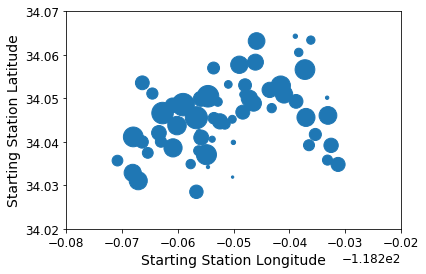

# 读取数据集😄


```python
import pandas as pd
import warnings

warnings.filterwarnings('ignore')
```


```python
data = pd.read_csv('./dataset/metro-bike-share-trip-data.csv')
```


```python
data.head(1)
```


<div>
<style scoped>
    .dataframe tbody tr th:only-of-type {
        vertical-align: middle;
    }

    .dataframe tbody tr th {
        vertical-align: top;
    }

    .dataframe thead th {
        text-align: right;
    }
</style>
<table border="1" class="dataframe">
  <thead>
    <tr style="text-align: right;">
      <th></th>
      <th>Trip ID</th>
      <th>Duration</th>
      <th>Start Time</th>
      <th>End Time</th>
      <th>Starting Station ID</th>
      <th>Starting Station Latitude</th>
      <th>Starting Station Longitude</th>
      <th>Ending Station ID</th>
      <th>Ending Station Latitude</th>
      <th>Ending Station Longitude</th>
      <th>Bike ID</th>
      <th>Plan Duration</th>
      <th>Trip Route Category</th>
      <th>Passholder Type</th>
      <th>Starting Lat-Long</th>
      <th>Ending Lat-Long</th>
    </tr>
  </thead>
  <tbody>
    <tr>
      <th>0</th>
      <td>1912818</td>
      <td>180</td>
      <td>2016-07-07T04:17:00</td>
      <td>2016-07-07T04:20:00</td>
      <td>3014.0</td>
      <td>34.05661</td>
      <td>-118.23721</td>
      <td>3014.0</td>
      <td>34.05661</td>
      <td>-118.23721</td>
      <td>6281.0</td>
      <td>30.0</td>
      <td>Round Trip</td>
      <td>Monthly Pass</td>
      <td>{'longitude': '-118.23721', 'latitude': '34.05...</td>
      <td>{'longitude': '-118.23721', 'latitude': '34.05...</td>
    </tr>
  </tbody>
</table>
</div>


```python
#data['Starting Lat-Long'][0]
data.shape
```


    (132427, 16)


---

# 挑选需要分析的列(Select necessary Columns)😥

### station_info


```python
station_info = data[['Starting Station ID','Starting Station Latitude','Starting Station Longitude','Ending Station ID','Ending Station Latitude','Ending Station Longitude']]
station_info.head()
```


<div>
<style scoped>
    .dataframe tbody tr th:only-of-type {
        vertical-align: middle;
    }

    .dataframe tbody tr th {
        vertical-align: top;
    }

    .dataframe thead th {
        text-align: right;
    }
</style>
<table border="1" class="dataframe">
  <thead>
    <tr style="text-align: right;">
      <th></th>
      <th>Starting Station ID</th>
      <th>Starting Station Latitude</th>
      <th>Starting Station Longitude</th>
      <th>Ending Station ID</th>
      <th>Ending Station Latitude</th>
      <th>Ending Station Longitude</th>
    </tr>
  </thead>
  <tbody>
    <tr>
      <th>0</th>
      <td>3014.0</td>
      <td>34.056610</td>
      <td>-118.23721</td>
      <td>3014.0</td>
      <td>34.056610</td>
      <td>-118.23721</td>
    </tr>
    <tr>
      <th>1</th>
      <td>3014.0</td>
      <td>34.056610</td>
      <td>-118.23721</td>
      <td>3014.0</td>
      <td>34.056610</td>
      <td>-118.23721</td>
    </tr>
    <tr>
      <th>2</th>
      <td>3016.0</td>
      <td>34.052898</td>
      <td>-118.24156</td>
      <td>3016.0</td>
      <td>34.052898</td>
      <td>-118.24156</td>
    </tr>
    <tr>
      <th>3</th>
      <td>3016.0</td>
      <td>34.052898</td>
      <td>-118.24156</td>
      <td>3016.0</td>
      <td>34.052898</td>
      <td>-118.24156</td>
    </tr>
    <tr>
      <th>4</th>
      <td>3032.0</td>
      <td>34.049889</td>
      <td>-118.25588</td>
      <td>3032.0</td>
      <td>34.049889</td>
      <td>-118.25588</td>
    </tr>
  </tbody>
</table>
</div>


```python
start_station = station_info[['Starting Station ID','Starting Station Longitude','Starting Station Latitude']]
#start_station.head()
```


```python
end_station = station_info[['Ending Station ID','Ending Station Longitude','Ending Station Latitude']]
#end_station.head()
```

### bike_info


```python
bike_info = data[['Duration','Start Time','End Time','Trip Route Category','Plan Duration','Passholder Type']]
bike_info.head()
```


<div>
<style scoped>
    .dataframe tbody tr th:only-of-type {
        vertical-align: middle;
    }

    .dataframe tbody tr th {
        vertical-align: top;
    }

    .dataframe thead th {
        text-align: right;
    }
</style>
<table border="1" class="dataframe">
  <thead>
    <tr style="text-align: right;">
      <th></th>
      <th>Duration</th>
      <th>Start Time</th>
      <th>End Time</th>
      <th>Trip Route Category</th>
      <th>Plan Duration</th>
      <th>Passholder Type</th>
    </tr>
  </thead>
  <tbody>
    <tr>
      <th>0</th>
      <td>180</td>
      <td>2016-07-07T04:17:00</td>
      <td>2016-07-07T04:20:00</td>
      <td>Round Trip</td>
      <td>30.0</td>
      <td>Monthly Pass</td>
    </tr>
    <tr>
      <th>1</th>
      <td>1980</td>
      <td>2016-07-07T06:00:00</td>
      <td>2016-07-07T06:33:00</td>
      <td>Round Trip</td>
      <td>30.0</td>
      <td>Monthly Pass</td>
    </tr>
    <tr>
      <th>2</th>
      <td>300</td>
      <td>2016-07-07T10:32:00</td>
      <td>2016-07-07T10:37:00</td>
      <td>Round Trip</td>
      <td>365.0</td>
      <td>Flex Pass</td>
    </tr>
    <tr>
      <th>3</th>
      <td>10860</td>
      <td>2016-07-07T10:37:00</td>
      <td>2016-07-07T13:38:00</td>
      <td>Round Trip</td>
      <td>365.0</td>
      <td>Flex Pass</td>
    </tr>
    <tr>
      <th>4</th>
      <td>420</td>
      <td>2016-07-07T12:51:00</td>
      <td>2016-07-07T12:58:00</td>
      <td>Round Trip</td>
      <td>0.0</td>
      <td>Walk-up</td>
    </tr>
  </tbody>
</table>
</div>


```python
data['Passholder Type'].value_counts()
```


    Monthly Pass    81304
    Walk-up         41224
    Flex Pass        9517
    Staff Annual      382
    Name: Passholder Type, dtype: int64


### trip_info


```python
trip_info = data[['Duration','Start Time','End Time','Starting Station ID','Ending Station ID','Trip Route Category','Plan Duration','Passholder Type']]
trip_info.head()
```


<div>
<style scoped>
    .dataframe tbody tr th:only-of-type {
        vertical-align: middle;
    }

    .dataframe tbody tr th {
        vertical-align: top;
    }

    .dataframe thead th {
        text-align: right;
    }
</style>
<table border="1" class="dataframe">
  <thead>
    <tr style="text-align: right;">
      <th></th>
      <th>Duration</th>
      <th>Start Time</th>
      <th>End Time</th>
      <th>Starting Station ID</th>
      <th>Ending Station ID</th>
      <th>Trip Route Category</th>
      <th>Plan Duration</th>
      <th>Passholder Type</th>
    </tr>
  </thead>
  <tbody>
    <tr>
      <th>0</th>
      <td>180</td>
      <td>2016-07-07T04:17:00</td>
      <td>2016-07-07T04:20:00</td>
      <td>3014.0</td>
      <td>3014.0</td>
      <td>Round Trip</td>
      <td>30.0</td>
      <td>Monthly Pass</td>
    </tr>
    <tr>
      <th>1</th>
      <td>1980</td>
      <td>2016-07-07T06:00:00</td>
      <td>2016-07-07T06:33:00</td>
      <td>3014.0</td>
      <td>3014.0</td>
      <td>Round Trip</td>
      <td>30.0</td>
      <td>Monthly Pass</td>
    </tr>
    <tr>
      <th>2</th>
      <td>300</td>
      <td>2016-07-07T10:32:00</td>
      <td>2016-07-07T10:37:00</td>
      <td>3016.0</td>
      <td>3016.0</td>
      <td>Round Trip</td>
      <td>365.0</td>
      <td>Flex Pass</td>
    </tr>
    <tr>
      <th>3</th>
      <td>10860</td>
      <td>2016-07-07T10:37:00</td>
      <td>2016-07-07T13:38:00</td>
      <td>3016.0</td>
      <td>3016.0</td>
      <td>Round Trip</td>
      <td>365.0</td>
      <td>Flex Pass</td>
    </tr>
    <tr>
      <th>4</th>
      <td>420</td>
      <td>2016-07-07T12:51:00</td>
      <td>2016-07-07T12:58:00</td>
      <td>3032.0</td>
      <td>3032.0</td>
      <td>Round Trip</td>
      <td>0.0</td>
      <td>Walk-up</td>
    </tr>
  </tbody>
</table>
</div>


---

## discover station info


```python
%matplotlib inline
import matplotlib
import matplotlib.pyplot as plt
plt.rcParams['axes.labelsize'] = 14
plt.rcParams['xtick.labelsize'] = 12
plt.rcParams['ytick.labelsize'] = 12
```


```python
start_station.head().dropna()
```


<div>
<style scoped>
    .dataframe tbody tr th:only-of-type {
        vertical-align: middle;
    }

    .dataframe tbody tr th {
        vertical-align: top;
    }

    .dataframe thead th {
        text-align: right;
    }
</style>
<table border="1" class="dataframe">
  <thead>
    <tr style="text-align: right;">
      <th></th>
      <th>Starting Station ID</th>
      <th>Starting Station Longitude</th>
      <th>Starting Station Latitude</th>
    </tr>
  </thead>
  <tbody>
    <tr>
      <th>0</th>
      <td>3014.0</td>
      <td>-118.23721</td>
      <td>34.056610</td>
    </tr>
    <tr>
      <th>1</th>
      <td>3014.0</td>
      <td>-118.23721</td>
      <td>34.056610</td>
    </tr>
    <tr>
      <th>2</th>
      <td>3016.0</td>
      <td>-118.24156</td>
      <td>34.052898</td>
    </tr>
    <tr>
      <th>3</th>
      <td>3016.0</td>
      <td>-118.24156</td>
      <td>34.052898</td>
    </tr>
    <tr>
      <th>4</th>
      <td>3032.0</td>
      <td>-118.25588</td>
      <td>34.049889</td>
    </tr>
  </tbody>
</table>
</div>


```python
grouped = start_station.groupby('Starting Station ID')
```


```python
count_value = start_station['Starting Station ID'].value_counts().values
```


```python
st_info = grouped.max()
st_info.insert(2,'Counts',count_value)
```


```python
st_info.head()
```


<div>
<style scoped>
    .dataframe tbody tr th:only-of-type {
        vertical-align: middle;
    }

    .dataframe tbody tr th {
        vertical-align: top;
    }

    .dataframe thead th {
        text-align: right;
    }
</style>
<table border="1" class="dataframe">
  <thead>
    <tr style="text-align: right;">
      <th></th>
      <th>Starting Station Longitude</th>
      <th>Starting Station Latitude</th>
      <th>Counts</th>
    </tr>
    <tr>
      <th>Starting Station ID</th>
      <th></th>
      <th></th>
      <th></th>
    </tr>
  </thead>
  <tbody>
    <tr>
      <th>3000.0</th>
      <td>NaN</td>
      <td>NaN</td>
      <td>5138</td>
    </tr>
    <tr>
      <th>3005.0</th>
      <td>-118.259048</td>
      <td>34.048550</td>
      <td>5059</td>
    </tr>
    <tr>
      <th>3006.0</th>
      <td>-118.256668</td>
      <td>34.045540</td>
      <td>4883</td>
    </tr>
    <tr>
      <th>3007.0</th>
      <td>-118.254590</td>
      <td>34.050480</td>
      <td>4661</td>
    </tr>
    <tr>
      <th>3008.0</th>
      <td>-118.262730</td>
      <td>34.046612</td>
      <td>4629</td>
    </tr>
  </tbody>
</table>
</div>


---

## discover bike info


```python
bike_info.head()
```


<div>
<style scoped>
    .dataframe tbody tr th:only-of-type {
        vertical-align: middle;
    }

    .dataframe tbody tr th {
        vertical-align: top;
    }

    .dataframe thead th {
        text-align: right;
    }
</style>
<table border="1" class="dataframe">
  <thead>
    <tr style="text-align: right;">
      <th></th>
      <th>Duration</th>
      <th>Start Time</th>
      <th>End Time</th>
      <th>Trip Route Category</th>
      <th>Plan Duration</th>
      <th>Passholder Type</th>
    </tr>
  </thead>
  <tbody>
    <tr>
      <th>0</th>
      <td>180</td>
      <td>2016-07-07T04:17:00</td>
      <td>2016-07-07T04:20:00</td>
      <td>Round Trip</td>
      <td>30.0</td>
      <td>Monthly Pass</td>
    </tr>
    <tr>
      <th>1</th>
      <td>1980</td>
      <td>2016-07-07T06:00:00</td>
      <td>2016-07-07T06:33:00</td>
      <td>Round Trip</td>
      <td>30.0</td>
      <td>Monthly Pass</td>
    </tr>
    <tr>
      <th>2</th>
      <td>300</td>
      <td>2016-07-07T10:32:00</td>
      <td>2016-07-07T10:37:00</td>
      <td>Round Trip</td>
      <td>365.0</td>
      <td>Flex Pass</td>
    </tr>
    <tr>
      <th>3</th>
      <td>10860</td>
      <td>2016-07-07T10:37:00</td>
      <td>2016-07-07T13:38:00</td>
      <td>Round Trip</td>
      <td>365.0</td>
      <td>Flex Pass</td>
    </tr>
    <tr>
      <th>4</th>
      <td>420</td>
      <td>2016-07-07T12:51:00</td>
      <td>2016-07-07T12:58:00</td>
      <td>Round Trip</td>
      <td>0.0</td>
      <td>Walk-up</td>
    </tr>
  </tbody>
</table>
</div>


```python
bike_info['Trip Route Category'].unique()
```


    array(['Round Trip', 'One Way'], dtype=object)


```python
bike_info['Passholder Type'].unique()
```


    array(['Monthly Pass', 'Flex Pass', 'Walk-up', 'Staff Annual'],
          dtype=object)


```python
# Plan Duration
bike_info['Plan Duration'].unique()
```


    array([ 30., 365.,   0.,  nan])


```python
bike_info.describe()
```


<div>
<style scoped>
    .dataframe tbody tr th:only-of-type {
        vertical-align: middle;
    }

    .dataframe tbody tr th {
        vertical-align: top;
    }

    .dataframe thead th {
        text-align: right;
    }
</style>
<table border="1" class="dataframe">
  <thead>
    <tr style="text-align: right;">
      <th></th>
      <th>Duration</th>
      <th>Plan Duration</th>
    </tr>
  </thead>
  <tbody>
    <tr>
      <th>count</th>
      <td>132427.000000</td>
      <td>131661.000000</td>
    </tr>
    <tr>
      <th>mean</th>
      <td>1555.301562</td>
      <td>44.821967</td>
    </tr>
    <tr>
      <th>std</th>
      <td>5814.241813</td>
      <td>90.411579</td>
    </tr>
    <tr>
      <th>min</th>
      <td>60.000000</td>
      <td>0.000000</td>
    </tr>
    <tr>
      <th>25%</th>
      <td>360.000000</td>
      <td>0.000000</td>
    </tr>
    <tr>
      <th>50%</th>
      <td>600.000000</td>
      <td>30.000000</td>
    </tr>
    <tr>
      <th>75%</th>
      <td>1080.000000</td>
      <td>30.000000</td>
    </tr>
    <tr>
      <th>max</th>
      <td>86400.000000</td>
      <td>365.000000</td>
    </tr>
  </tbody>
</table>
</div>


---

# 分析思路(Analysis methods)😜

- 热门Station分布分析(**Distribution of Hot Stations**)
- 2.共享单车出行高峰时间段分析(**Rush Hour Analysis**)
- 3.单程与往返的比较分析(**Round Trip/One Way Comparison Analysis**)
- 使用时长与会员卡类型的关联度分析(**relevancy analysis between Duration&Passholder Type**)

---

# 开始数据分析(Data Analysis)😁

### 1）共享单车热门开始站分布可视化探索


```python
pic = st_info.plot(kind="scatter", x="Starting Station Longitude", y="Starting Station Latitude",s = st_info['Counts']/10,
                        alpha=1)
plt.axis([-118.28,-118.22,34.02,34.07])
plt.show()
```





### Conclusion

- If there is a **L.A. map** should be better to analysis...

---

## 2）共享单车出行高峰时间段分析(Rush Hour Analysis)

### 正则提取时间(use regular expression to extract the Time)


```python
bike_info = bike_info.dropna()
```


```python
import re
from pandas import Series,DataFrame

pattern_time = '[0-9][0-9]:[0-9][0-9]:[0-9][0-9]'
pattern_hour = '[0-9][0-9]'
```


```python
timelist = []
for item in bike_info['Start Time']:
    #print(item)
    time = re.findall(pattern_time,item)[0]
    timelist.append(time)
#timelist
```


```python
timelist[:5]
```


    ['04:17:00', '06:00:00', '10:32:00', '10:37:00', '12:51:00']


### 提取hour(extract the Hour)


```python
hourlist = []
for item in timelist:
    hour = re.findall(pattern_hour,item)[0]
    hourlist.append(hour)
```


```python
hourlist[:5]
```


    ['04', '06', '10', '10', '12']


```python
timeSeries = Series(timelist)
hourSeries = Series(hourlist)
```


```python
bike_info.head()
```


<div>
<style scoped>
    .dataframe tbody tr th:only-of-type {
        vertical-align: middle;
    }

    .dataframe tbody tr th {
        vertical-align: top;
    }

    .dataframe thead th {
        text-align: right;
    }
</style>
<table border="1" class="dataframe">
  <thead>
    <tr style="text-align: right;">
      <th></th>
      <th>Duration</th>
      <th>Start Time</th>
      <th>End Time</th>
      <th>Trip Route Category</th>
      <th>Plan Duration</th>
      <th>Passholder Type</th>
    </tr>
  </thead>
  <tbody>
    <tr>
      <th>0</th>
      <td>180</td>
      <td>2016-07-07T04:17:00</td>
      <td>2016-07-07T04:20:00</td>
      <td>Round Trip</td>
      <td>30.0</td>
      <td>Monthly Pass</td>
    </tr>
    <tr>
      <th>1</th>
      <td>1980</td>
      <td>2016-07-07T06:00:00</td>
      <td>2016-07-07T06:33:00</td>
      <td>Round Trip</td>
      <td>30.0</td>
      <td>Monthly Pass</td>
    </tr>
    <tr>
      <th>2</th>
      <td>300</td>
      <td>2016-07-07T10:32:00</td>
      <td>2016-07-07T10:37:00</td>
      <td>Round Trip</td>
      <td>365.0</td>
      <td>Flex Pass</td>
    </tr>
    <tr>
      <th>3</th>
      <td>10860</td>
      <td>2016-07-07T10:37:00</td>
      <td>2016-07-07T13:38:00</td>
      <td>Round Trip</td>
      <td>365.0</td>
      <td>Flex Pass</td>
    </tr>
    <tr>
      <th>4</th>
      <td>420</td>
      <td>2016-07-07T12:51:00</td>
      <td>2016-07-07T12:58:00</td>
      <td>Round Trip</td>
      <td>0.0</td>
      <td>Walk-up</td>
    </tr>
  </tbody>
</table>
</div>


```python
bike_info.insert(3,'Start Hour',hourSeries)
```


```python
bike_info.head()
```


<div>
<style scoped>
    .dataframe tbody tr th:only-of-type {
        vertical-align: middle;
    }

    .dataframe tbody tr th {
        vertical-align: top;
    }

    .dataframe thead th {
        text-align: right;
    }
</style>
<table border="1" class="dataframe">
  <thead>
    <tr style="text-align: right;">
      <th></th>
      <th>Duration</th>
      <th>Start Time</th>
      <th>End Time</th>
      <th>Start Hour</th>
      <th>Trip Route Category</th>
      <th>Plan Duration</th>
      <th>Passholder Type</th>
    </tr>
  </thead>
  <tbody>
    <tr>
      <th>0</th>
      <td>180</td>
      <td>2016-07-07T04:17:00</td>
      <td>2016-07-07T04:20:00</td>
      <td>04</td>
      <td>Round Trip</td>
      <td>30.0</td>
      <td>Monthly Pass</td>
    </tr>
    <tr>
      <th>1</th>
      <td>1980</td>
      <td>2016-07-07T06:00:00</td>
      <td>2016-07-07T06:33:00</td>
      <td>06</td>
      <td>Round Trip</td>
      <td>30.0</td>
      <td>Monthly Pass</td>
    </tr>
    <tr>
      <th>2</th>
      <td>300</td>
      <td>2016-07-07T10:32:00</td>
      <td>2016-07-07T10:37:00</td>
      <td>10</td>
      <td>Round Trip</td>
      <td>365.0</td>
      <td>Flex Pass</td>
    </tr>
    <tr>
      <th>3</th>
      <td>10860</td>
      <td>2016-07-07T10:37:00</td>
      <td>2016-07-07T13:38:00</td>
      <td>10</td>
      <td>Round Trip</td>
      <td>365.0</td>
      <td>Flex Pass</td>
    </tr>
    <tr>
      <th>4</th>
      <td>420</td>
      <td>2016-07-07T12:51:00</td>
      <td>2016-07-07T12:58:00</td>
      <td>12</td>
      <td>Round Trip</td>
      <td>0.0</td>
      <td>Walk-up</td>
    </tr>
  </tbody>
</table>
</div>


```python
Start_Hour_counts = bike_info['Start Hour'].value_counts().sort_index()
#Start_Hour_counts.index
```


```python
from pyecharts import Line

attr =list(map(int, Start_Hour_counts.index))
v =  Start_Hour_counts.values
line = Line("Rush Hour Analysis")
line.add("", attr, v,mark_point=["min","max"],is_smooth=True)

line
```

    ERROR:lml.utils:failed to import pyecharts_snapshot
    Traceback (most recent call last):
      File "C:\Users\13626\Anaconda3\lib\site-packages\lml\utils.py", line 43, in do_import
        plugin_module = __import__(plugin_module_name)
    ModuleNotFoundError: No module named 'pyecharts_snapshot'
    


### Conclusion

- 共享单车出行者通常选择在**7a.m.-20p.m.**出行
- **6a.m.-8a.m.**早高峰时段，**10a.m.-12a.m.**午高峰时段以及**15a.m.-17a.m.晚高峰时段**都有明显的用车量增加。
- 出行最高峰是**17p.m**.，推测为**下班晚高峰**
- 出行最低谷为**4a.m.**，凌晨的用车辆非常少
- 从高峰到低谷是一个完全**下降趋势**，用车辆逐渐降低

- Shared-bike riders usually choose to start their trip at **7a.m.-20p.m**
- **6a.m.-8a.m.**morning peak period, **10a.m.-12a.m.**afternoon peak period and **15a.m.-17a.m.**evening peak period shows significant increase in shared-bike use
- The peak of use is **17p.m.**, which is presumed to be **the evening peak**
- The lowest point of use is **4a.m**,few shared-bikes are used in mid-night
- From the peak to the lowest point is a **complete downward trend**, with the vehicle gradually reduced

---

## 3）单车使用时长与会员卡持有种类的相关性分析
## (relevancy analysis between Duration&Passholder Type)


```python
bike_trip_info = bike_info[['Duration','Trip Route Category','Plan Duration','Passholder Type']]
bike_trip_info.head()
```


<div>
<style scoped>
    .dataframe tbody tr th:only-of-type {
        vertical-align: middle;
    }

    .dataframe tbody tr th {
        vertical-align: top;
    }

    .dataframe thead th {
        text-align: right;
    }
</style>
<table border="1" class="dataframe">
  <thead>
    <tr style="text-align: right;">
      <th></th>
      <th>Duration</th>
      <th>Trip Route Category</th>
      <th>Plan Duration</th>
      <th>Passholder Type</th>
    </tr>
  </thead>
  <tbody>
    <tr>
      <th>0</th>
      <td>180</td>
      <td>Round Trip</td>
      <td>30.0</td>
      <td>Monthly Pass</td>
    </tr>
    <tr>
      <th>1</th>
      <td>1980</td>
      <td>Round Trip</td>
      <td>30.0</td>
      <td>Monthly Pass</td>
    </tr>
    <tr>
      <th>2</th>
      <td>300</td>
      <td>Round Trip</td>
      <td>365.0</td>
      <td>Flex Pass</td>
    </tr>
    <tr>
      <th>3</th>
      <td>10860</td>
      <td>Round Trip</td>
      <td>365.0</td>
      <td>Flex Pass</td>
    </tr>
    <tr>
      <th>4</th>
      <td>420</td>
      <td>Round Trip</td>
      <td>0.0</td>
      <td>Walk-up</td>
    </tr>
  </tbody>
</table>
</div>


### 单独提取Duration，进行聚类(cluster by Duration)


```python
duration = bike_trip_info[['Duration']]
duration.head()
# duration时间单位为 秒
```


<div>
<style scoped>
    .dataframe tbody tr th:only-of-type {
        vertical-align: middle;
    }

    .dataframe tbody tr th {
        vertical-align: top;
    }

    .dataframe thead th {
        text-align: right;
    }
</style>
<table border="1" class="dataframe">
  <thead>
    <tr style="text-align: right;">
      <th></th>
      <th>Duration</th>
    </tr>
  </thead>
  <tbody>
    <tr>
      <th>0</th>
      <td>180</td>
    </tr>
    <tr>
      <th>1</th>
      <td>1980</td>
    </tr>
    <tr>
      <th>2</th>
      <td>300</td>
    </tr>
    <tr>
      <th>3</th>
      <td>10860</td>
    </tr>
    <tr>
      <th>4</th>
      <td>420</td>
    </tr>
  </tbody>
</table>
</div>


```python
from sklearn.cluster import KMeans # 导入Kmeans

k=4 # 聚类类别数
kmodel = KMeans(n_clusters=k, n_jobs=4)
kmodel.fit(duration)
```


    KMeans(algorithm='auto', copy_x=True, init='k-means++', max_iter=300,
        n_clusters=4, n_init=10, n_jobs=4, precompute_distances='auto',
        random_state=None, tol=0.0001, verbose=0)


```python
# 查看聚类中心
kmodel.cluster_centers_
```


    array([[  852.28531007],
           [79762.47011952],
           [38263.11864407],
           [ 9696.06469003]])


```python
# 从低到高的排序
c = pd.DataFrame(kmodel.cluster_centers_).sort_values(0)
c['Duration Class'] = ['short-time','medium-time','long-time','very-long-time']
c.columns=['Duration','Duration Class']
c
```


<div>
<style scoped>
    .dataframe tbody tr th:only-of-type {
        vertical-align: middle;
    }

    .dataframe tbody tr th {
        vertical-align: top;
    }

    .dataframe thead th {
        text-align: right;
    }
</style>
<table border="1" class="dataframe">
  <thead>
    <tr style="text-align: right;">
      <th></th>
      <th>Duration</th>
      <th>Duration Class</th>
    </tr>
  </thead>
  <tbody>
    <tr>
      <th>0</th>
      <td>852.285310</td>
      <td>short-time</td>
    </tr>
    <tr>
      <th>3</th>
      <td>9696.064690</td>
      <td>medium-time</td>
    </tr>
    <tr>
      <th>2</th>
      <td>38263.118644</td>
      <td>long-time</td>
    </tr>
    <tr>
      <th>1</th>
      <td>79762.470120</td>
      <td>very-long-time</td>
    </tr>
  </tbody>
</table>
</div>


```python
# 获取聚类后各类别的index
short = c[c['Duration Class']=='short-time'].index[0]
medium = c[c['Duration Class']=='medium-time'].index[0]
long = c[c['Duration Class']=='long-time'].index[0]
verylong = c[c['Duration Class']=='very-long-time'].index[0]
```


```python
# duration映射函数
duration_map = {
    short:'short-time',
    medium:'medium-time',
    long:'long-time',
    verylong:'very-long-time'
}
```


```python
labels = kmodel.labels_
#labels：聚类结果对应的标签
```

### 将聚类后的结果插入bike_trip_info中(Insert the results into the ***bike_trip_info***)


```python
bike_trip_info.insert(1,'Duration Class',labels)
```


```python
# map映射函数
bike_trip_info['Duration Class'] = bike_trip_info['Duration Class'].map(duration_map)
```


```python
bike_trip_info.head()
```


<div>
<style scoped>
    .dataframe tbody tr th:only-of-type {
        vertical-align: middle;
    }

    .dataframe tbody tr th {
        vertical-align: top;
    }

    .dataframe thead th {
        text-align: right;
    }
</style>
<table border="1" class="dataframe">
  <thead>
    <tr style="text-align: right;">
      <th></th>
      <th>Duration</th>
      <th>Duration Class</th>
      <th>Trip Route Category</th>
      <th>Plan Duration</th>
      <th>Passholder Type</th>
    </tr>
  </thead>
  <tbody>
    <tr>
      <th>0</th>
      <td>180</td>
      <td>short-time</td>
      <td>Round Trip</td>
      <td>30.0</td>
      <td>Monthly Pass</td>
    </tr>
    <tr>
      <th>1</th>
      <td>1980</td>
      <td>short-time</td>
      <td>Round Trip</td>
      <td>30.0</td>
      <td>Monthly Pass</td>
    </tr>
    <tr>
      <th>2</th>
      <td>300</td>
      <td>short-time</td>
      <td>Round Trip</td>
      <td>365.0</td>
      <td>Flex Pass</td>
    </tr>
    <tr>
      <th>3</th>
      <td>10860</td>
      <td>medium-time</td>
      <td>Round Trip</td>
      <td>365.0</td>
      <td>Flex Pass</td>
    </tr>
    <tr>
      <th>4</th>
      <td>420</td>
      <td>short-time</td>
      <td>Round Trip</td>
      <td>0.0</td>
      <td>Walk-up</td>
    </tr>
  </tbody>
</table>
</div>


**查看各类Duration数量**


```python
bike_trip_info['Duration Class'].value_counts()
```


    short-time        127230
    medium-time         3339
    long-time            590
    very-long-time       502
    Name: Duration Class, dtype: int64


---

### Duration Class探索

#### very-long-time 探索


```python
verylong_counts = bike_trip_info[bike_trip_info['Duration Class']=='very-long-time']['Plan Duration'].value_counts()
series1 = verylong_counts/sum(verylong_counts)
series1
```


    0.0      0.808765
    30.0     0.141434
    365.0    0.049801
    Name: Plan Duration, dtype: float64


#### long-time 探索


```python
long_counts = bike_trip_info[bike_trip_info['Duration Class']=='long-time']['Plan Duration'].value_counts()
series2 = long_counts/sum(long_counts)
```

#### medium-time 探索


```python
medium_counts = bike_trip_info[bike_trip_info['Duration Class']=='medium-time']['Plan Duration'].value_counts()
series3 = medium_counts/sum(medium_counts)
```

#### short-time 探索


```python
short_counts = bike_trip_info[bike_trip_info['Duration Class']=='short-time']['Plan Duration'].value_counts()
series4 = short_counts/sum(short_counts)
series4 = series4.sort_index()
```

---

### 雷达图可视化(Radar Chart)


```python
duration_rate = DataFrame(list(zip(series1,series2,series3)))
```


```python
duration_rate.columns = ['very-long-time','long-time','medium-time']
duration_rate.index = ['0','30','365']
```


```python
duration_rate = duration_rate[['medium-time','long-time','very-long-time']]
duration_rate.insert(0,'short-time',series4.values)
```


```python
duration_rate
```


<div>
<style scoped>
    .dataframe tbody tr th:only-of-type {
        vertical-align: middle;
    }

    .dataframe tbody tr th {
        vertical-align: top;
    }

    .dataframe thead th {
        text-align: right;
    }
</style>
<table border="1" class="dataframe">
  <thead>
    <tr style="text-align: right;">
      <th></th>
      <th>short-time</th>
      <th>medium-time</th>
      <th>long-time</th>
      <th>very-long-time</th>
    </tr>
  </thead>
  <tbody>
    <tr>
      <th>0</th>
      <td>0.297862</td>
      <td>0.756214</td>
      <td>0.671186</td>
      <td>0.808765</td>
    </tr>
    <tr>
      <th>30</th>
      <td>0.628979</td>
      <td>0.195867</td>
      <td>0.288136</td>
      <td>0.141434</td>
    </tr>
    <tr>
      <th>365</th>
      <td>0.073159</td>
      <td>0.047919</td>
      <td>0.040678</td>
      <td>0.049801</td>
    </tr>
  </tbody>
</table>
</div>


```python
from pyecharts import Radar

schema = [("0",0.81), ("30", 0.63), ("365", 0.08)]
v1 = [duration_rate['short-time'].values.round(2)]
v2 = [duration_rate['medium-time'].values.round(2)]
v3 = [duration_rate['long-time'].values.round(2)]
v4 = [duration_rate['very-long-time'].values.round(2)]

radar = Radar("Radar chart")
radar.config(schema)
radar.add("short-time", v1, is_splitline=True, is_axisline_show=True)
radar.add("medium-time", v2, is_area_show=False, legend_selectedmode='single')
radar.add("long-time", v3, is_area_show=False, legend_selectedmode='single')
radar.add("very-long-time", v4, is_area_show=False, legend_selectedmode='single')
radar
```

.png)
.png)
.png)


### Conclusion

- 共享单车使用使用时间**特别长**的用户中**绝大部分使用者**是**即用即走型用户**
- **短途**共享单车使用者中**超过6成比例**为**月卡持有者**
- 其次，**短途**共享单车使用者中的**年卡持有者**的比例也是所有类型中**最高的**

- The **majority** of users who use shared-bikes for a **very-long-time** are those who use them **immediately**.
- **Over 60%** of users who use shared-bikes for a **short-time** are those who possess **Monthly-Pass**.
-  The percentage of those who possess Flex-Pass among **short-time trip** bike users is also the **highest among all types**.

---

## 4）单程与往返的比较分析(Round Trip/One Way Comparison Analysis)


```python
trip_info.head()
```


<div>
<style scoped>
    .dataframe tbody tr th:only-of-type {
        vertical-align: middle;
    }

    .dataframe tbody tr th {
        vertical-align: top;
    }

    .dataframe thead th {
        text-align: right;
    }
</style>
<table border="1" class="dataframe">
  <thead>
    <tr style="text-align: right;">
      <th></th>
      <th>Duration</th>
      <th>Start Time</th>
      <th>End Time</th>
      <th>Starting Station ID</th>
      <th>Ending Station ID</th>
      <th>Trip Route Category</th>
      <th>Plan Duration</th>
      <th>Passholder Type</th>
    </tr>
  </thead>
  <tbody>
    <tr>
      <th>0</th>
      <td>180</td>
      <td>2016-07-07T04:17:00</td>
      <td>2016-07-07T04:20:00</td>
      <td>3014.0</td>
      <td>3014.0</td>
      <td>Round Trip</td>
      <td>30.0</td>
      <td>Monthly Pass</td>
    </tr>
    <tr>
      <th>1</th>
      <td>1980</td>
      <td>2016-07-07T06:00:00</td>
      <td>2016-07-07T06:33:00</td>
      <td>3014.0</td>
      <td>3014.0</td>
      <td>Round Trip</td>
      <td>30.0</td>
      <td>Monthly Pass</td>
    </tr>
    <tr>
      <th>2</th>
      <td>300</td>
      <td>2016-07-07T10:32:00</td>
      <td>2016-07-07T10:37:00</td>
      <td>3016.0</td>
      <td>3016.0</td>
      <td>Round Trip</td>
      <td>365.0</td>
      <td>Flex Pass</td>
    </tr>
    <tr>
      <th>3</th>
      <td>10860</td>
      <td>2016-07-07T10:37:00</td>
      <td>2016-07-07T13:38:00</td>
      <td>3016.0</td>
      <td>3016.0</td>
      <td>Round Trip</td>
      <td>365.0</td>
      <td>Flex Pass</td>
    </tr>
    <tr>
      <th>4</th>
      <td>420</td>
      <td>2016-07-07T12:51:00</td>
      <td>2016-07-07T12:58:00</td>
      <td>3032.0</td>
      <td>3032.0</td>
      <td>Round Trip</td>
      <td>0.0</td>
      <td>Walk-up</td>
    </tr>
  </tbody>
</table>
</div>


### 划分出单程与往返的frame(Divide the 'Round Trip'&'One Way')


```python
one_way_trip = trip_info[trip_info['Trip Route Category']=='One Way']
round_trip = trip_info[trip_info['Trip Route Category']=='Round Trip']
```


```python
one_way_trip.head()
```


<div>
<style scoped>
    .dataframe tbody tr th:only-of-type {
        vertical-align: middle;
    }

    .dataframe tbody tr th {
        vertical-align: top;
    }

    .dataframe thead th {
        text-align: right;
    }
</style>
<table border="1" class="dataframe">
  <thead>
    <tr style="text-align: right;">
      <th></th>
      <th>Duration</th>
      <th>Start Time</th>
      <th>End Time</th>
      <th>Starting Station ID</th>
      <th>Ending Station ID</th>
      <th>Trip Route Category</th>
      <th>Plan Duration</th>
      <th>Passholder Type</th>
    </tr>
  </thead>
  <tbody>
    <tr>
      <th>5</th>
      <td>780</td>
      <td>2016-07-07T12:51:00</td>
      <td>2016-07-07T13:04:00</td>
      <td>3021.0</td>
      <td>3054.0</td>
      <td>One Way</td>
      <td>30.0</td>
      <td>Monthly Pass</td>
    </tr>
    <tr>
      <th>6</th>
      <td>600</td>
      <td>2016-07-07T12:54:00</td>
      <td>2016-07-07T13:04:00</td>
      <td>3022.0</td>
      <td>3014.0</td>
      <td>One Way</td>
      <td>30.0</td>
      <td>Monthly Pass</td>
    </tr>
    <tr>
      <th>7</th>
      <td>600</td>
      <td>2016-07-07T12:59:00</td>
      <td>2016-07-07T13:09:00</td>
      <td>3076.0</td>
      <td>3005.0</td>
      <td>One Way</td>
      <td>365.0</td>
      <td>Flex Pass</td>
    </tr>
    <tr>
      <th>9</th>
      <td>960</td>
      <td>2016-07-07T13:01:00</td>
      <td>2016-07-07T13:17:00</td>
      <td>3031.0</td>
      <td>3078.0</td>
      <td>One Way</td>
      <td>30.0</td>
      <td>Monthly Pass</td>
    </tr>
    <tr>
      <th>10</th>
      <td>960</td>
      <td>2016-07-07T13:02:00</td>
      <td>2016-07-07T13:18:00</td>
      <td>3031.0</td>
      <td>3047.0</td>
      <td>One Way</td>
      <td>365.0</td>
      <td>Flex Pass</td>
    </tr>
  </tbody>
</table>
</div>


```python
#one_way_trip.shape
```


```python
round_trip.head()
```


<div>
<style scoped>
    .dataframe tbody tr th:only-of-type {
        vertical-align: middle;
    }

    .dataframe tbody tr th {
        vertical-align: top;
    }

    .dataframe thead th {
        text-align: right;
    }
</style>
<table border="1" class="dataframe">
  <thead>
    <tr style="text-align: right;">
      <th></th>
      <th>Duration</th>
      <th>Start Time</th>
      <th>End Time</th>
      <th>Starting Station ID</th>
      <th>Ending Station ID</th>
      <th>Trip Route Category</th>
      <th>Plan Duration</th>
      <th>Passholder Type</th>
    </tr>
  </thead>
  <tbody>
    <tr>
      <th>0</th>
      <td>180</td>
      <td>2016-07-07T04:17:00</td>
      <td>2016-07-07T04:20:00</td>
      <td>3014.0</td>
      <td>3014.0</td>
      <td>Round Trip</td>
      <td>30.0</td>
      <td>Monthly Pass</td>
    </tr>
    <tr>
      <th>1</th>
      <td>1980</td>
      <td>2016-07-07T06:00:00</td>
      <td>2016-07-07T06:33:00</td>
      <td>3014.0</td>
      <td>3014.0</td>
      <td>Round Trip</td>
      <td>30.0</td>
      <td>Monthly Pass</td>
    </tr>
    <tr>
      <th>2</th>
      <td>300</td>
      <td>2016-07-07T10:32:00</td>
      <td>2016-07-07T10:37:00</td>
      <td>3016.0</td>
      <td>3016.0</td>
      <td>Round Trip</td>
      <td>365.0</td>
      <td>Flex Pass</td>
    </tr>
    <tr>
      <th>3</th>
      <td>10860</td>
      <td>2016-07-07T10:37:00</td>
      <td>2016-07-07T13:38:00</td>
      <td>3016.0</td>
      <td>3016.0</td>
      <td>Round Trip</td>
      <td>365.0</td>
      <td>Flex Pass</td>
    </tr>
    <tr>
      <th>4</th>
      <td>420</td>
      <td>2016-07-07T12:51:00</td>
      <td>2016-07-07T12:58:00</td>
      <td>3032.0</td>
      <td>3032.0</td>
      <td>Round Trip</td>
      <td>0.0</td>
      <td>Walk-up</td>
    </tr>
  </tbody>
</table>
</div>


```python
one_way_trip['Passholder Type'].value_counts()
```


    Monthly Pass    77532
    Walk-up         32777
    Flex Pass        9034
    Staff Annual      299
    Name: Passholder Type, dtype: int64


```python
round_trip['Passholder Type'].value_counts()
```


    Walk-up         8447
    Monthly Pass    3772
    Flex Pass        483
    Staff Annual      83
    Name: Passholder Type, dtype: int64


```python

```
